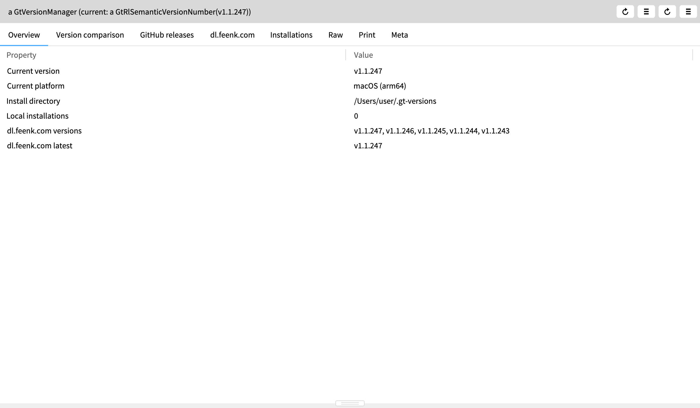
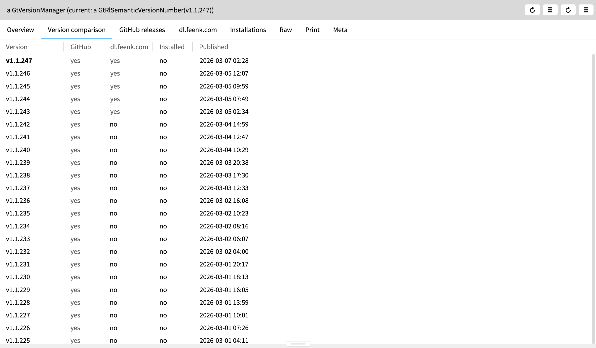
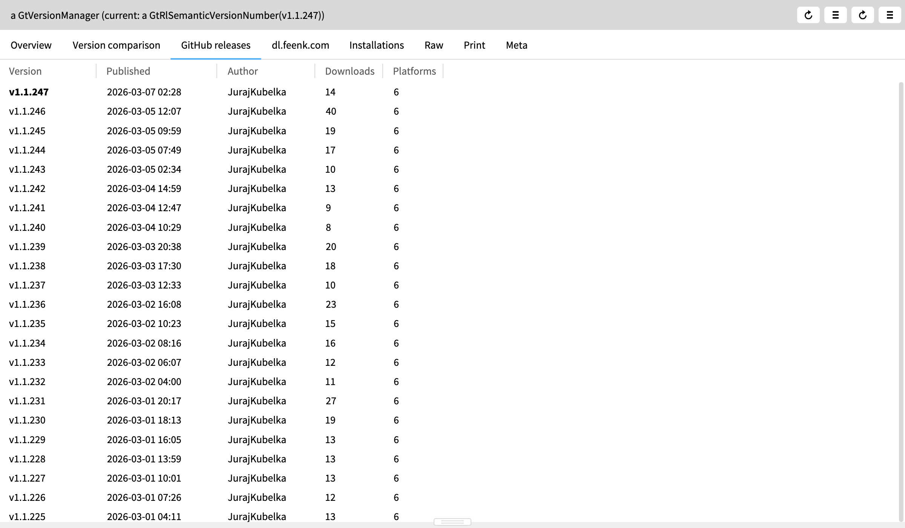
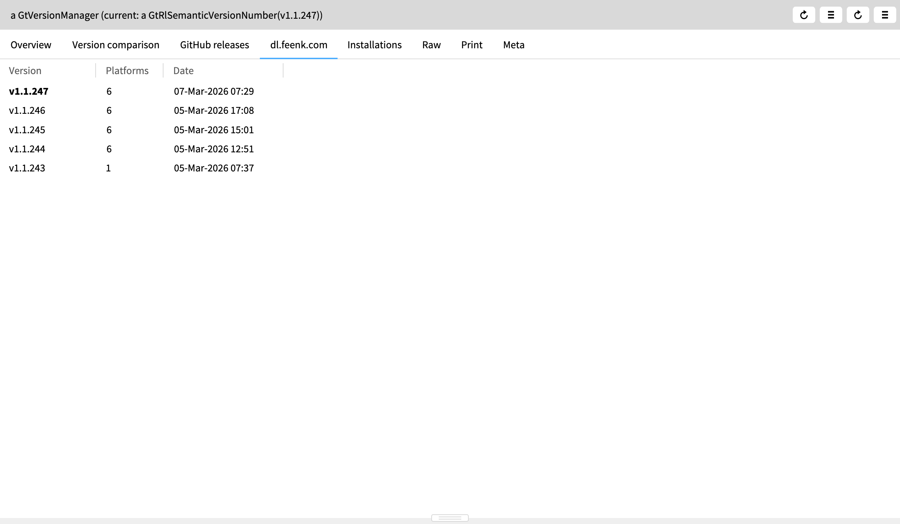
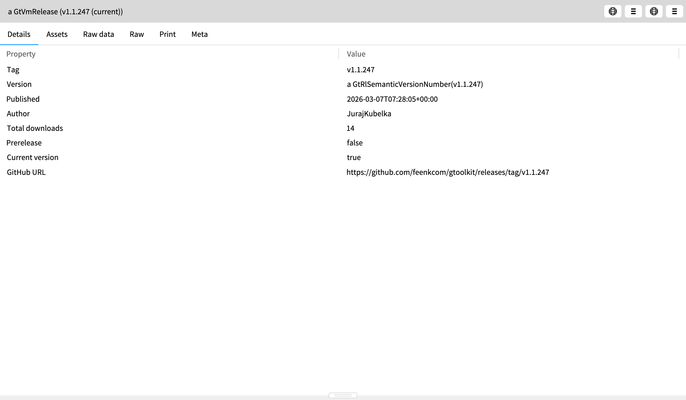
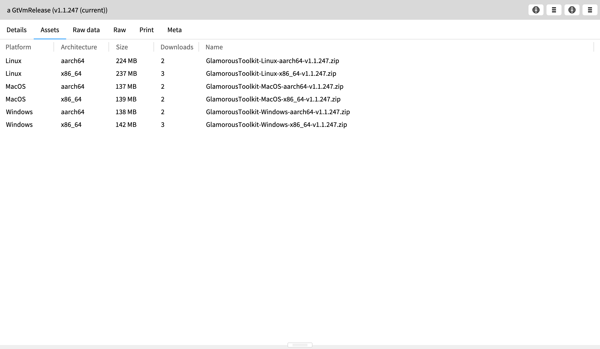

# GT Version Manager

A Glamorous Toolkit version manager built inside GT itself. Browse available releases from GitHub and dl.feenk.com, compare versions, and download/install/launch different GT versions.

## Quick Start

```smalltalk
GtVersionManager default inspect
```

## Screenshots

### Overview
Current version, platform, and data source summary at a glance.



### Version Comparison
Unified view across GitHub releases, dl.feenk.com CDN, and local installations. Current version is **bold**.



### GitHub Releases
Browse the 30 most recent releases with publish dates, authors, and download counts.



### dl.feenk.com
The feenk CDN lists the most recent ~5 versions with all 6 platform builds. Current version is **bold**.



### Release Detail
Drill into any release to see full metadata including version, author, total downloads, and whether it matches your running image.



### Release Assets
Each release has platform-specific builds for Linux, macOS, and Windows (both x86_64 and aarch64).



## Package: `GToolkit-VersionManager`

### Classes

| Class | Purpose |
|-------|---------|
| `GtVersionManager` | Main entry point (singleton). Fetches from GitHub + dl.feenk.com, manages local installs. |
| `GtVmRelease` | Single GitHub release with version, date, author, assets, download stats. |
| `GtVmAsset` | Single release asset with platform/arch parsing, size, SHA-256 digest. |
| `GtVmReleaseGroup` | Collection of releases with list and download stats views. |
| `GtVmAssetGroup` | Collection of assets filtered by platform builds. |
| `GtVmFeenkSite` | Parses dl.feenk.com/gt/ HTML directory listing. |
| `GtVmFeenkEntry` | Single file entry from dl.feenk.com. |
| `GtVmInstallation` | Local GT installation on disk with launch capability. |
| `GtVmObject` | Base class with rawData pattern. |
| `GtVersionManagerExamples` | Examples exercising the full stack. |

### Data Sources

- **GitHub API** (`feenkcom/gtoolkit`): 6,687+ releases, download counts, SHA-256 digests, author info. Paginated, 30 per page by default.
- **dl.feenk.com/gt/**: ~5 most recent versions, 6 platform builds each, stable "release pointer" URLs.

### Key Features

- **Platform detection**: Auto-detects OS + architecture via `uname -m`
- **Version comparison**: Unified table showing each version's availability across GitHub, dl.feenk.com, and local installs
- **Download & install**: Downloads the correct platform zip to `~/.gt-versions/{tag}/`, extracts it
- **Launch**: Opens installed versions (macOS `open` for .app bundles)
- **Caching**: Singleton with cached API responses; use the refresh button to update

### API Usage

```smalltalk
"Get the singleton"
vm := GtVersionManager default.

"Browse GitHub releases"
vm githubReleases.                    "30 most recent"
vm githubReleasesPerPage: 100 page: 1.  "paginated"
vm githubLatestRelease.               "just the latest"
vm githubReleaseForTag: 'v1.1.245'.   "specific version"

"Browse dl.feenk.com"
vm feenkSite versions.                "available version strings"
vm feenkSite versionedBuilds.         "all platform builds"
vm feenkSite buildsForVersion: 'v1.1.247'.

"Local installations"
vm installations.                     "list installed versions"
vm installRelease: aRelease.          "download + extract"

"Refresh cached data"
vm refresh.
```
